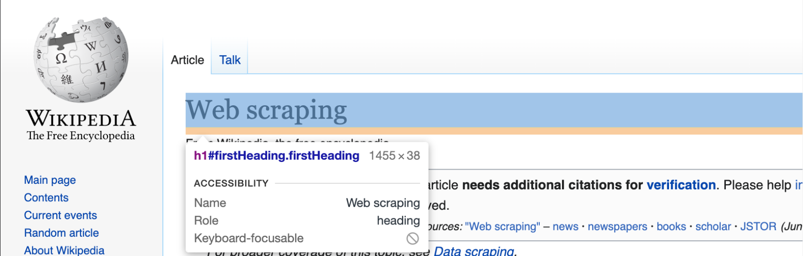

# Wikipedia Scraper
 by Daniel Bauwens

 

## Description
This is my web scraping project, where the goal is to improve my skills with things like requests, BeautifulSoup and Regex.

## Installation & Requirements
You can use this on Python 3.11, and use 'pip install -r requirements.txt' to get all necessary packages.

## Usage
To run the code, simply open your command prompt(cmd), powershell or vscode terminal window and type "python leaders_scraper.py" or use the path to both the python.exe and the main.py file. That would look something like this:

'c:/Users/Daniel/Documents/GitHub/Wikipedia-Scraper/.wikipedia_scraper_env/Scripts/python.exe c:/Users/Daniel/Documents/GitHub/Wikipedia-Scraper/leaders_scraper.py'

## Timeline
This project took 3 days to complete. I started on Wed(21/06/2023) and finished Fri(23/06/2023).

## About me
My name is Daniel Bauwens, I'm a 26 year old Junior Data Scientist. I am part of the ARAI 5 student group @ BeCode in Ghent, Belgium.

My github: https://github.com/danielbauwens
My linkedin: https://www.linkedin.com/in/daniel-bauwens-5515a8256/

## Credits
Special thanks to my fellow BeCoders without whom I wouldn't have been able to complete this in time.
